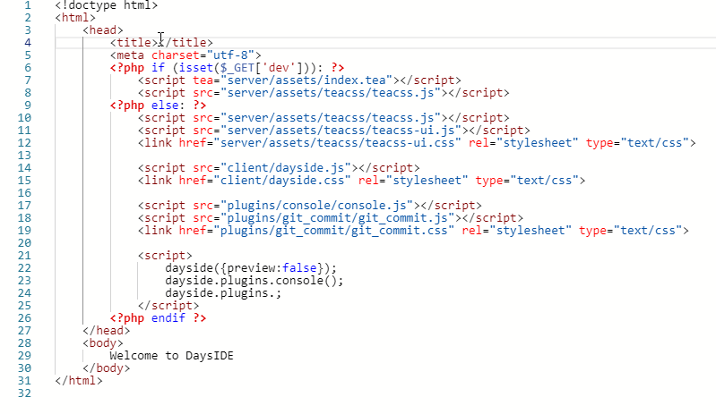
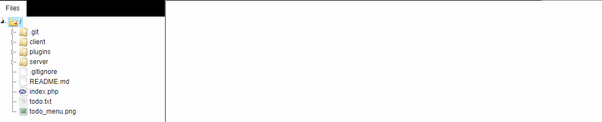
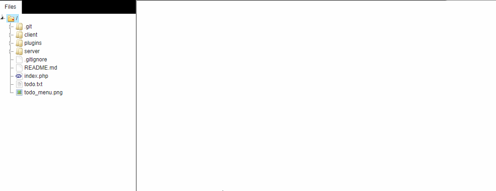

    

    
    
    

    Web IDE based on <a href="https://github.com/boomyjee/teacss-ui">TeaCSS-UI</a> and <a href="https://microsoft.github.io/monaco-editor">Monaco</a> editor.

## Features

### Full featured text editor based on monaco

### Git user interface with commit/history view/blame/diff support

### Interactive console

## Installation

- just clone the repo to the server with php support (5.3+)
- make sure that the folder with dayside has correct permissions (read, write and execute)
- open dayside in browser (execute index.php file) and set a password
- enjoy the editor

### License

Dayside is [MIT licensed](./LICENSE).

